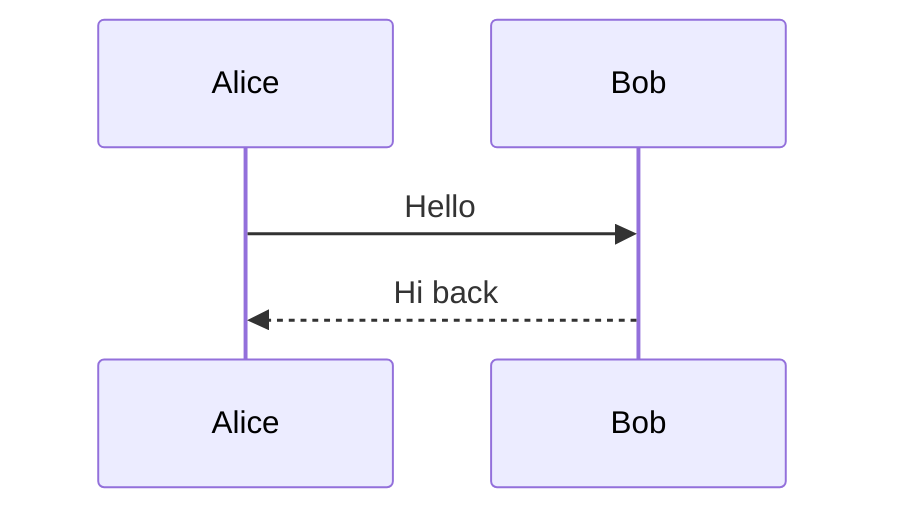

# Create diagrams with Mermaid

Create a diagram from the most recent interaction context using Mermaid. Generate a PNG image with a transparent background and output it as a markdown image so it renders inline.

## How to create a diagram

1. Extract or derive diagrammable data from the current context.
2. If the Emacs foreground color and background mode are not already known from a previous diagram in this session, query them:
   ```sh
   emacsclient --eval '(face-foreground (quote default))'
   emacsclient --eval '(frame-parameter nil (quote background-mode))'
   ```
   The first returns a hex color like `"#eeffff"`. The second returns `dark` or `light`. Reuse both for all subsequent diagrams.
3. Write a Mermaid file to a temporary file.
4. Write a JSON config file that overrides theme variables with the queried foreground color. Set `"theme"` to `"dark"` or `"default"` based on the background mode.
5. Run `mmdc` with `-t dark` if background mode is `dark`, or `-t default` if `light`.
6. Output the result as a markdown image on its own line:
   ```
   
   ```

```sh
# Use -t dark for dark, -t default for light
CHROMIUM_BIN="$(command -v chromium || command -v chromium-browser || command -v google-chrome || command -v google-chrome-stable)"
PUPPETEER_EXECUTABLE_PATH="$CHROMIUM_BIN" mmdc \
  -i /tmp/agent-diagram-XXXX.mmd \
  -o /tmp/agent-diagram-XXXX.png \
  -t dark -b transparent --scale 2 \
  --configFile /tmp/agent-diagram-XXXX-config.json
```

## Mermaid config template

Write this JSON config file to apply the Emacs foreground color. Replace `#eeffff` with the queried color. Set `"theme"` to `"dark"` or `"default"` based on the Emacs background mode.

```json
{
  "theme": "dark",
  "themeVariables": {
    "primaryTextColor": "#eeffff",
    "secondaryTextColor": "#eeffff",
    "tertiaryTextColor": "#eeffff",
    "primaryBorderColor": "#eeffff",
    "lineColor": "#eeffff",
    "textColor": "#eeffff",
    "actorTextColor": "#eeffff",
    "actorBorder": "#eeffff",
    "signalColor": "#eeffff",
    "signalTextColor": "#eeffff",
    "labelTextColor": "#eeffff",
    "loopTextColor": "#eeffff",
    "noteTextColor": "#eeffff",
    "noteBorderColor": "#eeffff",
    "sectionTextColor": "#eeffff",
    "titleColor": "#eeffff"
  }
}
```

## Mermaid diagram template



## Rules

- Query the Emacs foreground color once per session and reuse it for all subsequent diagrams. Only query again if the color is not already known.
- Query the Emacs background mode once per session via `(frame-parameter nil 'background-mode)`. Use `-t dark` for `dark` or `-t default` for `light`. Always use `-b transparent --scale 2`.
- Always resolve a Chromium executable dynamically (`chromium`, `chromium-browser`, `google-chrome`, or `google-chrome-stable`) and set `PUPPETEER_EXECUTABLE_PATH` to it when invoking `mmdc`.
- Always write a JSON config file with `themeVariables` set to the queried foreground color and pass it via `--configFile`.
- Always use a timestamp in the filename (e.g., `/tmp/agent-diagram-$(date +%s).png`). Never use descriptive names.
- After mmdc runs successfully, output a markdown image (``) on its own line.
- Choose an appropriate diagram type for the data (sequence, flowchart, class, state, er, gantt, etc.).
- Include a title when it adds clarity.
- If no diagrammable data exists in the recent context, inform the user.
